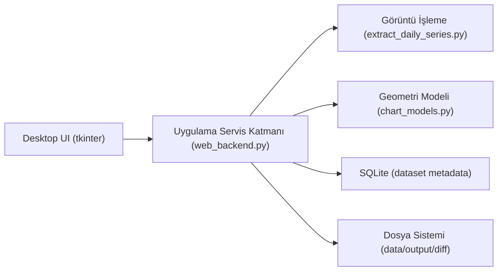

# ArtikongrafConverter
Bu uygulama "Kandilli’nin 115 Yıllık İklim Hafızası: Sayısallaştırma ve Analiz" Hackathon etkinliğinde kodlanmıştır ve Lang takımının ürünüdür. Etkinliği düzenleyen başta Hüseyin Birkan Yılmaz ve Şenol Solum hocalarım olmak üzere herkese teşekkür ederim. 

Python Uygulama Proje Mimarisi (AktinografConverter)
Bu doküman, yalnızca Python uygulamasının mimarisini anlatır. Kapsam: masaüstü arayüz, görüntü işleme hattı, manuel düzeltme hattı, dosya çıktıları ve veri saklama modeli.

1. Amaç ve Kapsam
Uygulamanın hedefi, aktinograf kağıt grafiğindeki radyasyon eğrisini otomatik olarak okuyup dakika bazında sayısal veriye çevirmek, gerektiğinde kullanıcıya bu veriyi manuel olarak düzeltme imkanı vermek ve tüm çıktıları (CSV + karşılaştırma görselleri) tutarlı biçimde güncellemektir.

Sistem yalnızca radyasyon akışı için optimize edilmiştir:

Saat ekseni: 20:00 başlangıç, ertesi gün 19:59 bitiş.
Toplam örnekleme: 1440 nokta (dakikalık).
Değer aralığı: 0.0 - 2.0.
2. Katmanlı Mimari

Desktop UI (tkinter)
Uygulama Servis Katmanı(web_backend.py)
Görüntü İşleme(extract_daily_series.py)
Geometri Modeli(chart_models.py)
SQLite (dataset metadata)
Dosya Sistemi(data/output/diff)
Katmanlar:

Sunum katmanı: desktop_app.py
Uygulama servis katmanı: web_backend.py
Alan/geometri katmanı: chart_models.py
Görüntü işleme katmanı: extract_daily_series.py
Altyapı katmanı: SQLite + dosya sistemi + OpenCV/Pillow
3. Modül Bazlı Sorumluluklar
Modül	Sorumluluk
main_app.py	Runtime root belirler, veri klasörlerini hazırlar, uygulamayı başlatır
desktop_app.py	3 sekmeli masaüstü UI (Import/Edit/Review), async görev yönetimi, kullanıcı etkileşimi
web_backend.py	Import, process, save, delete, DB işlemleri, CSV/diff üretim orkestrasyonu
chart_models.py	Eksen eğrileri, x/y <-> hour/value dönüşümleri, template seçimi
extract_daily_series.py	Hizalama (ECC), trace skor üretimi, path çıkarımı, spike onarımı, dakikalık resampling
convert_tiff_dataset.py	Toplu TIFF dönüştürme yardımcı aracı (opsiyonel)
4. Uçtan Uca Veri Akışı
Kullanıcı Import sekmesinden görsel seçer (png/jpg/jpeg/tif/tiff).
TIFF ise import aşamasında otomatik PNG dönüşümü yapılır.
Kayıt metadata’sı SQLite datasets tablosuna yazılır.
Process tetiklenince görüntü işleme hattı çalışır.
Otomatik seri CSV + diff görselleri + aligned görsel üretilir.
Edit sekmesinde kullanıcı eğri noktalarını sürükler, önizleme canlı güncellenir.
Kaydet ve İşle sonrası current CSV + current diff güncellenir.
Review sekmesinde auto/current eğri karşılaştırılır, tablo görüntülenir ve CSV indirilebilir.
5. Görüntü İşleme Hattı (Detay)
5.1 Hizalama
Girdi görsel, template boyutuna ölçeklenir.
cv2.findTransformECC ile homografi bulunur.
Perspektif warp uygulanarak çizelge template koordinat sistemine oturtulur.
ECC başarısızsa resize fallback kullanılır.
5.2 ROI (grafik alanı) kısıtlama
chart_models içindeki üst-alt eğri polinomlarıyla geçerli çizim bandı tanımlanır.
Sol/sağ saat sınırları modelin left_hour_x + hour_step_px parametreleriyle belirlenir.
Bu sayede kağıdın tablo dışı bölgeleri analize dahil edilmez.
5.3 Trace skor haritası
HSV uzayında dominant kalem tonu bulunur.
Grid çizgileri (kağıt baskısı) baskılanır.
Renk skoru + blackhat morfolojik özellik birleştirilir.
Sonuç trace_score görüntüsüne çevrilir.
5.4 Yol çıkarımı (path extraction)
Her x kolonunda aday y’ler seçilir.
Dinamik programlama ile sürekliliği en iyi yol hesaplanır.
Medyan + hareketli ortalama filtre ile stabil hat elde edilir.
5.5 Fiziksel dönüşüm
x,y noktaları model eğrileri ile saat ve radyasyon değerine çevrilir.
Radyasyon saat bias düzeltmesi uygulanır (1.5+ seviyelerinde saat kayması düzeltmesi).
5.6 Dakikalık yeniden örnekleme
Seri dakikalık eksene zorlanır: 20:00 -> 19:59 (1440 nokta).
hour_precise formatı HH.MM üretilir.
5.7 Anomali/spike onarımı
Gece penceresi dışında (<4 ve >=20) değerler 0 yapılır.
Mürekkep kaynaklı ani/gerçek dışı sıçramalar hedefli olarak köprülenir.
Global smoothing yapılmaz; sadece belirgin anomali blokları düzeltilir.
spike_margin_int parametresi dedektör agresifliğini ayarlar.
6. Manuel Edit Mimarisi
Edit ekranı iki bileşenli çalışır:

Altta aligned source image
Üstte düzenlenebilir yeşil eğri + sürüklenebilir handle noktaları
Temel mekanizma:

Handle taşınınca x/y yeni konuma gider.
Handle’lardan anchor listesi çıkarılır.
apply_anchor_edits ile anchor noktaları arasında lineer geçiş üretilir.
Sadece radyasyon değeri güncellenir; y modelden geri hesaplanır.
Z ile son taşıma geri alınır (undo stack).
Kaydet ve İşle ile kalıcı yazma yapılır.
İş kuralı:

Manuel edit sonrası da gece penceresi kuralı korunur (4:00-20:00 dışı 0).
7. Review Mimarisi
Review sekmesi üç çıktıyı birlikte sunar:

Auto vs Current çizgi karşılaştırması (2D grafik)
Güncel diff görseli (source + reconstructed panel)
Sayısal tablo (hour_precise, radiation, x, y)
Ek yetenekler:

Grafik hover: en yakın noktada Saat + Radiation gösterimi
Tabloyu dışa aktarma: CSV indirme (source_file, hour_precise, radiation, x, y)
8. Veri Saklama Modeli
8.1 Dosya yapısı
data/uploaded/: import edilen kaynak dosyalar
output/<stem>_series.csv: güncel seri (manual edit sonrası güncellenir)
output/auto/<stem>_series_auto.csv: otomatik ilk seri
diff/<stem>_diff.png: güncel karşılaştırma görseli
diff/auto/<stem>_diff_auto.png: otomatik karşılaştırma görseli
output/aligned/<stem>_aligned.png: edit ekranı için hizalanmış kaynak
output/all_series.csv: tüm processed current serilerin birleşimi
8.2 SQLite (output/webapp.sqlite3)
Tek ana tablo: datasets

Kimlik ve dosya: id, source_name, stem, stored_path
Durum: status, processed, has_manual_edit, last_error
Zamanlar: imported_at, processed_at
Parametre: spike_margin_int
Çıktı yolları: auto_csv_path, current_csv_path, auto_diff_path, current_diff_path, aligned_image_path
9. Runtime ve Paketleme
main_app.py runtime root seçimini yönetir:

Geliştirme modunda: proje klasörü
.app (frozen) modunda: ~/AktinografConverterData
AKTINOGRAF_PROJECT_ROOT env değişkeni varsa override eder
Böylece macOS .app içinde yazma izin sorunları olmadan tüm data/çıktı dosyaları kalıcı kullanıcı klasöründe tutulur.

10. Hata Yönetimi ve Dayanıklılık
UI işlemleri thread’de çalışır, ana arayüz bloklanmaz.
Uzun işlemlerde yükleniyor popup’ı gösterilir.
DB’de status/error alanlarıyla kayıt bazlı hata izlenir.
TIFF importunda çift fallback vardır:
Pillow tabanlı dönüşüm
OpenCV decode/encode fallback
Tek dosya hatası toplu importu tamamen düşürmez (kısmi başarı desteklenir).
11. Tasarım Kararları (Neden Bu Mimari?)
UI ile processing ayrımı, test ve bakım maliyetini düşürür.
Model tabanlı geometri (chart_models) sayesinde manuel piksel sabitlerine bağımlılık azalır.
Dakikalık normalize seri (1440 nokta), downstream analizleri kolaylaştırır.
Auto/current çift çıktısı, manuel düzeltme izlenebilirliğini sağlar.
Diff panel üretimi, kalite kontrolü görsel olarak hızlandırır.
12. Gelecek Geliştirme İçin Uygun Noktalar
Farklı chart tipleri için yeni ChartModel ekleme
Multi-template otomatik seçim skorlama
Edit ekranında segment bazlı kısıtlı sürükleme (yalnızca y ekseni vb.)
Batch kalite metriği (coverage/strength eşikleriyle otomatik işaretleme)
Unit test katmanı: model dönüşümleri + spike onarım fonksiyonları
